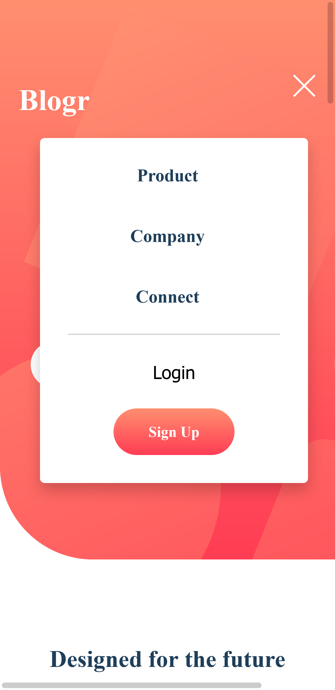
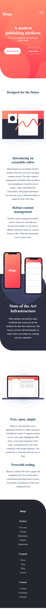

# Frontend Mentor Challenge - Blogr landing page

​	The second challenge it's the Blogr landing page from the website Frontend Mentor, on this challenge i needed to make a responsive website, and create a modal on the mobile version, it's not finished yet, but it's almost.

<h3>What I learned</h3>

 Until now the most complicate thing is the modal, who transform into a navigation on the desktop version. I've learned about so much things, like <strong>Grid</strong>, <strong>addEventListener</strong> and <strong>querySelector</strong>. So far it was very interesting. 

<h4>Check out a print of my challenge on the mobile version below.</h4>

